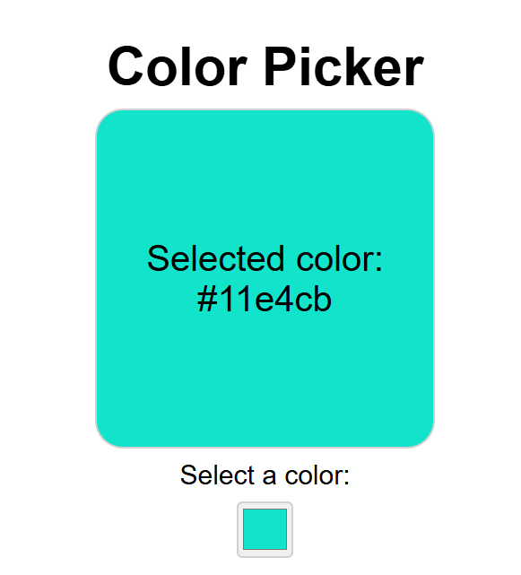

# Color Picker App
This color picker app is a React Component which allows the user to select a color.

# How is it Implemented
- We make use of useState() hook in React to set the color selected by the user.
- We make use of the onChange event handler for real time update of the selected color based on the pick made by the user in the input element. Hence, when the the user picks a color in the input field the change is reflected in the div container displaying the selected color in real time.
- All the html tags of h1, p, label and input are wrapped in a div container for styling and is styled using CSS. 

# Output

